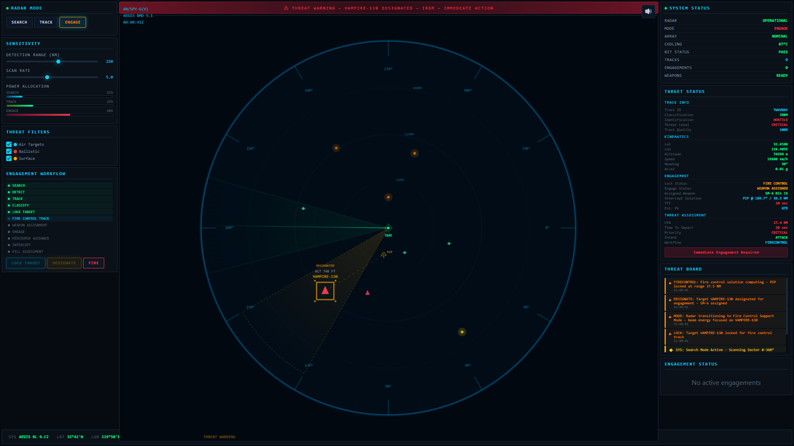

<p align="center">
  <a href="README.md">English</a> |
  <strong>简体中文</strong>
</p>

<h1 align="center">AN/SPY-6(V) 宙斯盾作战系统 — 相控阵雷达仿真</h1>

<p align="center">
  <strong>HTML5 Canvas · Web Audio API · Pure JavaScript · Zero Dependencies</strong>
  <br>
  海基防空反导 | 多目标探测跟踪 | 火控交战 | SM-6 导弹拦截 | PPI 显示
</p>

<p align="center">
  <a href="LICENSE"></a>
  <a href="https://evangel2022.github.io/radar-simulation/"></a>
  <a href="https://github.com/evangel2022/radar-simulation/actions/workflows/ci.yml"></a>
  <a href="#"></a>
  <a href="#"></a>
  <a href="CONTRIBUTING.md"></a>
</p>

<p align="center">
  
</p>

---

基于 Web 标准技术的纯前端交互式**宙斯盾作战系统 (Aegis Combat System)** 仿真器，完整模拟美海军 **AN/SPY-6(V) 相控阵雷达** 的多目标探测、跟踪、分类、威胁评估、火控锁定、武器分配与导弹拦截全流程。采用 HTML5 Canvas 渲染 PPI 雷达显示，Web Audio API 程序化生成音效，无需任何后端、框架或外部依赖，单个 HTML 文件即可运行。

---

## 目录

- [功能特性](#功能特性)
- [快速开始](#快速开始)
- [操作指南](#操作指南)
- [技术栈](#技术栈)
- [项目结构](#项目结构)
- [贡献指南](#贡献指南)
- [许可证](#许可证)
- [免责声明](#免责声明)

---

## 功能特性

### 雷达仿真
| 特性 | 说明 |
|------|------|
| **PPI 平面位置指示器** | 360° 旋转扫描线、多级距离环、方位刻度标记 |
| **多目标生成引擎** | 空中目标（战斗机、巡航导弹、无人机）、弹道导弹（IRBM/MRBM/SRBM）、水面舰艇，每种目标独立运动学模型 |
| **四种雷达模式** | 体搜索 (Volume Search) / 监视 (Surveillance) / 精确跟踪 (Precision Track) / 火控支持 (Fire Control Support) |
| **自适应资源分配** | SEARCH / TRACK / ENGAGE 三通道功率条，随模式动态调整 |
| **可调参数** | 探测距离 (50–2000 km)、扫描速率 (0.5–4.0 rpm)、扇区扫描角度 |

### 火控与交战
| 特性 | 说明 |
|------|------|
| **11 步交战工作流** | SEARCH → DETECT → TRACK → CLASSIFY → LOCK → FIRE CONTROL → WEAPON ASSIGNMENT → ENGAGE → MIDCOURSE GUIDANCE → INTERCEPT → KILL ASSESSMENT |
| **目标标定 (DESIGNATE)** | 贴近宙斯盾战术逻辑的两阶段确认：选择目标 → 指派交战 |
| **武器系统** | SM-6 导弹发射、中段制导、终端拦截全程可视化 |
| **预测拦截点 (PIP)** | 实时解算并渲染命中几何 (Intercept Geometry) |

### 视觉与交互
| 特性 | 说明 |
|------|------|
| **深色海军风格 UI** | 军用控制台视觉设计，CSS 变量主题系统 |
| **目标锁定动画** | 脉冲锁定框、航迹历史轨迹线、预测飞行路径向量 |
| **威胁告警面板** | 顶部滚动横幅 + 分级告警列表 + 威胁等级颜色编码 |
| **目标状态仪表板** | 四段式面板（航迹信息 / 运动学 / 交战状态 / 威胁评估） |

### 音频反馈
| 特性 | 说明 |
|------|------|
| **程序化音效** | Web Audio API OscillatorNode 实时合成，零音频文件 |
| **5 类核心音效** | 告警蜂鸣 · 锁定提示音 · 导弹发射音 · 拦截爆炸音 · 雷达脉冲音 |
| **性能保护** | 单 AudioContext 实例，并发上限 3 通道，全局静音控制 |

---

## 快速开始

### 前置要求

- **现代浏览器** — Chrome 90+ / Firefox 90+ / Edge 90+
- 无需 Node.js、Python 或任何构建工具

### 运行

```bash
# 方式一：直接打开（推荐）
# 双击 index.html 或在浏览器中打开

# 方式二：Python HTTP 服务器
python -m http.server 8080 --directory .
# 浏览器访问 http://localhost:8080

# 方式三：Node.js
npx serve .
```

> **提示：** 浏览器自动播放策略可能要求用户首次点击页面以激活 AudioContext，音效将在点击后生效。

---

## 操作指南

| 操作 | 效果 |
|------|------|
| 点击雷达画布上的目标 | 选中目标，右侧面板显示完整信息 |
| 点击 **LOCK TARGET** | 锁定目标，进入火控跟踪模式 |
| 点击 **DESIGNATE** | 标定目标用于交战，分配 SM-6 导弹 |
| 点击 **FIRE** | 发射导弹，开始拦截流程 |
| 切换模式按钮 **SEARCH / TRACK / ENGAGE** | 切换雷达工作模式 |
| 拖动 **Range** 滑块 | 调整探测距离范围 (50–2000 km) |
| 拖动 **Scan Rate** 滑块 | 调整扫描速率 (0.5–4.0 rpm) |
| 勾选/取消类型过滤器 | 按类型筛选目标（空中/弹道/水面） |
| 点击右上角 🔊 | 切换全局音效开关 |

---

## 技术栈

| 类别 | 技术 | 说明 |
|------|------|------|
| **渲染** | Canvas 2D API | 60fps PPI 雷达扫描、目标航迹、粒子特效 |
| **音频** | Web Audio API | OscillatorNode + GainNode 程序化合成 |
| **样式** | CSS3 | 自定义属性 (Custom Properties)、Grid、Flexbox |
| **逻辑** | Vanilla JavaScript | ES5 兼容，无框架、无构建、无转译 |
| **部署** | Static HTML | 单文件，直接托管于 GitHub Pages / 任意静态服务器 |

---

## 项目结构

```
radar-simulation/
├── index.html                  # 主程序（HTML + CSS + JS 单文件自包含）
├── README.md                   # Project Documentation (English)
├── README_CN.md                # 项目文档 (Chinese)
├── radar.png                   # 截图（PPI 雷达显示）
├── LICENSE                     # MIT 开源许可证
├── CONTRIBUTING.md             # 贡献指南
├── package.json                # 项目元数据与 npm scripts
├── .gitignore                  # Git 忽略规则
└── .github/
    └── workflows/
        └── ci.yml              # CI/CD：HTML 验证 + GitHub Pages 部署
```

---

## 贡献指南

欢迎提交 Issue 和 Pull Request。请参阅 [CONTRIBUTING.md](CONTRIBUTING.md) 了解贡献流程、分支策略、代码规范与提交信息格式。

---

## 许可证

本项目基于 [MIT License](LICENSE) 开源。

---

## 免责声明

本项目为教育性与演示性仿真系统，**不包含任何机密或真实军事数据**。所有视觉表现、行为参数与技术指标均为模拟实现，不代表任何真实武器系统的实际性能或作战能力。

---

<p align="center">
  <sub>
    Keywords: radar simulation, phased array radar, Aegis combat system, AN/SPY-6, missile defense, naval radar, PPI display, fire control system, HTML5 Canvas, Web Audio API, vanilla JavaScript, military simulation, air defense, ballistic missile defense, SM-6 interceptor
  </sub>
</p>